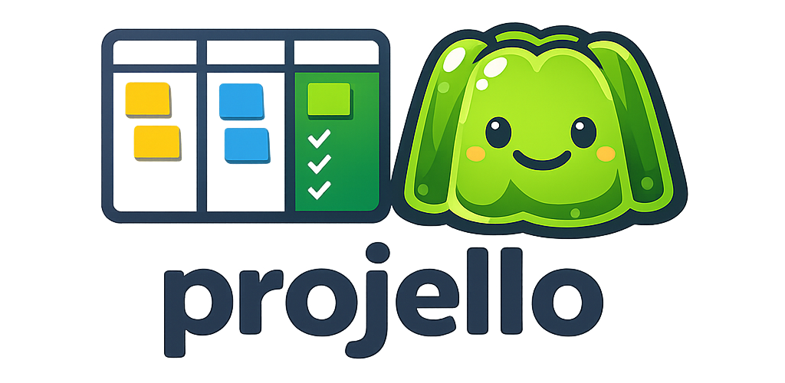
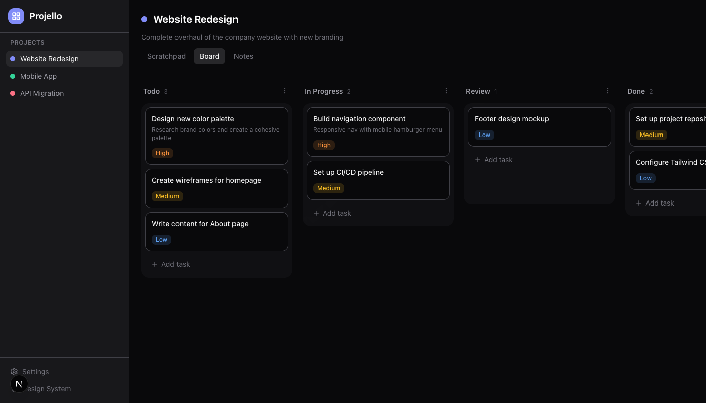

<p align="center">
  
</p>

<h1 align="center">Projello</h1>

<p align="center">Local-first project management app with Kanban boards. No accounts, no cloud — your data lives in a SQLite database on your machine.</p>



## Features

- **Dashboard** — Overview of all projects with task/column counts
- **Kanban Board** — Drag-and-drop task management across columns
- **Scratchpad** — Per-project auto-saving text editor for quick notes and ideas
- **Notes Timeline** — Timestamped project updates and logs
- **Configurable Storage** — Store your database anywhere, including inside a git repo

## Tech Stack

- Next.js 16 (App Router, Turbopack)
- Tailwind CSS v4
- Drizzle ORM + better-sqlite3
- @dnd-kit (drag-and-drop)
- TypeScript

## Getting Started

```bash
npm install
npm run dev
```

Open [http://localhost:1337](http://localhost:1337).

The database and config are created automatically in `.projello/` on first run.

## Scripts

| Command | Description |
|---------|-------------|
| `npm run dev` | Start dev server on port 1337 |
| `npm run build` | Production build |
| `npm start` | Start production server on port 1337 |
| `npm run db:seed` | Seed the database with demo data |
| `npm run db:push` | Push schema changes to the database |
| `npm run db:studio` | Open Drizzle Studio |

## Database

Projello uses a local SQLite database. On first startup it:

1. Creates a `.projello/` directory in the project root
2. Creates `projello.db` inside it
3. Auto-creates all tables

### Custom database location

You can point Projello to a different database file via **Settings** in the sidebar, or by editing `.projello/config.json` directly:

```json
{
  "databasePath": "/path/to/your/projello.db"
}
```

This is useful if you want to store the database inside a git repo or a synced folder. If the file doesn't exist, it will be created automatically with all tables.

## Project Structure

```
src/
  app/
    page.tsx                    # Dashboard
    settings/page.tsx           # Database settings
    design-system/page.tsx      # Component showcase
    projects/[id]/
      page.tsx                  # Scratchpad (default tab)
      board/page.tsx            # Kanban board
      notes/page.tsx            # Notes timeline
  actions/                      # Server actions (all mutations)
  components/
    ui/                         # Primitives (button, input, dialog, etc.)
    kanban-board.tsx             # DnD board orchestrator
    scratchpad-editor.tsx        # Auto-saving text editor
  db/
    schema.ts                   # Drizzle schema (4 tables)
    seed.ts                     # Demo data
  lib/
    config.ts                   # .projello/config.json reader/writer
    db.ts                       # Database connection with auto-setup
    utils.ts                    # cn(), timeAgo(), formatDate()
```
